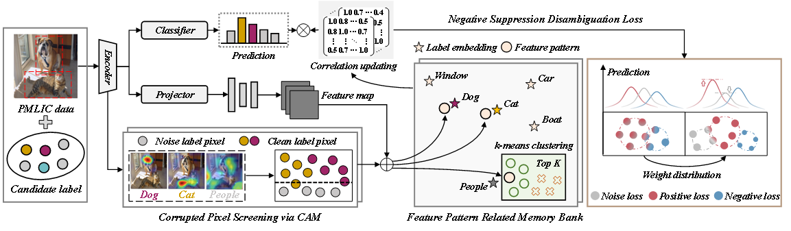

## CoNeS--Correlation-Induced Negative Suppression Disambiguation Loss for Partial Multi-label Image Classification
[Paper]() |
[Pretrained models](#Validation)  |
[Datasets](#Dataset)

Official PyTorch Implementation

The article "Correlation-Induced Negative Suppression Disambiguation Loss for Partial Multi-label Image Classification" has been accepted by **IEEE Transactions on Circuits and Systems for Video Technology (TCSVT 2025)**.

> Jingyu Zhong, Ronghua Shang, Shasha Mao, Jinhong Ren, Weitong Zhang

### Abstract
Partial multi-label image classification (PMLIC) learns from typical weak supervision, where each image is labeled with a set of candidate labels, only some of which are correct. We find that noisy labels generate conflicting gradient signals that disrupt the learning of latent true labels, causing the model to prefer learning clean negative labels that provide consistent supervisory signals, thereby hindering disambiguation. Meanwhile, noisy labels cause the model to activate misattributed pixel regions, which interfere with feature pattern extraction, leading to inaccurate label correlation. In this paper, we propose a PMLIC framework that constructs a correlation-induced negative suppression disambiguation loss (CoNeS). First, we exploit the property that networks tend to learn clean labels first by extracting class activation maps to identify and screen misattributed pixel regions. Meanwhile, we aggregate noise-disturbed feature patterns into more expressive representations via k-means clustering and construct accurate label correlations to aid disambiguation. In addition, we design the negative suppression disambiguation loss to focus the model on disambiguation by introducing a weight distribution to suppress the contribution of negative labels. This weighting distribution can be adaptively inferred by a closed-form solution. Extensive experiments demonstrate that the CoNeS framework achieves significant advantages over current state-of-the-art methods. Specifically, it achieves average mAP improvements of 1.26%, 2.74%, 0.85%, and 0.33% on the VOC 2007, MS-COCO, VG-256, and CUB-200 datasets at different resolutions and noise rates.



## Requirements
- Python 3.7
- pytorch 1.6
- torchvision 0.7.0
- pycocotools 2.0
- tqdm 4.49.0, pillow 7.2.0

### Dataset
We first provide access to the datasets to be evaluated/trained for deep partial multi-label learning, the [VOC2012/2007](http://host.robots.ox.ac.uk/pascal/VOC/), [MS-COCO](https://cocodataset.org/#download), [VG-256](https://github.com/zhongjingyu1/CoNeS/tree/master/Dataset/VG), [CUB-200](https://data.caltech.edu/records/65de6-vp158) and [NUS-WIDE](https://huggingface.co/datasets/Lxyhaha/NUS-WIDE)/[split](https://miil-public-eu.oss-eu-central-1.aliyuncs.com/model-zoo/ASL/nus_wid_data.csv)(nus_wid_data.csv) datasets need to be downloaded. Since some urls for download have been deleted, we employ the dataset version in [ASL](https://openaccess.thecvf.com/content/ICCV2021/papers/Ridnik_Asymmetric_Loss_for_Multi-Label_Classification_ICCV_2021_paper.pdf). Arrange the downloaded dataset in the following way:
```
Shell
├── Dataset
    ├── COCO2014
        ├── images
            ├── train2014
                ├── COCO_train2014_000000000009.jpg
                ...
            ├── val2014
                ├── COCO_val2014_000000000042.jpg
                ...
        ├── annotations
            ├── instances_train2014.json
            ...
    ├── VOCdevkit
        ├── VOC2007
            ├── Annotations
            ├── ImageSets
            ├── JPEGImages
                ├── 0000001.jpg
                ...
            ├── SegementationClass
            ├── SegementationObject
    ├── nuswide
        ├── images
            ├── 0_2124494179_b039ddccac_m.jpg
            ...
    ├── VG
        ├── VG_100K
            ├── 1.jpg
            ...
        ├── formatted_train_images.npy
        ├── formatted_train_labels.npy
        ├── formatted_val_images.npy
        ├── formatted_val_labels.npy
        ├── objects.json
        ├── vg256.json
```
In order to provide a fair comparison environment, we placed the various three noise labeling environments of the constructed VOC2007 and MS-COCO datasets in pre-processed-data.
```
pre-processed-data/coco_0.05.npy
pre-processed-data/coco_0.1.npy
pre-processed-data/coco_0.2.npy
pre-processed-data/voc07_0.1.npy
pre-processed-data/voc07_0.2.npy
pre-processed-data/voc07_0.4.npy
```
You can also generate your own noise labels by simply deleting the existing .npy file and running the training code directly.

### Experiments
We provide training code for adding noise on the VOC2007 and MS-COCO datasets:
```
python main_CoNeS.py --dataset voc07 --num_cls 20 --img_size 224/448 --batch_size 16 --partial_rate 0.1/0.2/0.4 --path_images "Dataset/VOCdevkit" --r_ws 3
python main_CoNeS.py --dataset coco --num_cls 80 --img_size 224/448 --batch_size 16 --partial_rate 0.05/0.1/0.2 --path_images "Dataset/COCO2014" --r_ws 2
```
We similarly provide training code on the real-world dataset NUS-WIDE, which has no added noise:
```
python main_real.py --dataset nuswide --num_cls 81 --img_size 224/448 --batch_size 16 --path_images "Dataset/nuswide" --r_ws 3 
```
We also provide a BCE baseline code `main_BCE.py`, which you can run as follows:
```
python main_BCE.py --dataset voc07 --num_cls 20 --img_size 224/448 --batch_size 16 --partial_rate 0.1/0.2/0.4 --path_images "Dataset/VOCdevkit"
python main_BCE.py --dataset coco --num_cls 80 --img_size 224/448 --batch_size 16 --partial_rate 0.05/0.1/0.2 --path_images "Dataset/COCO2014"
```
### Validation
We provide pretrained models on Google Drive for validation. ResNet101 trained on ImageNet can be downloaded [here](https://download.pytorch.org/models/resnet101-5d3b4d8f.pth).
|  Dataset  |   Backbone |  $$\rho$$|  mAP(%) |  Resolution	  |     Download      |
| :---------: |:---------:| :------------: | :-----------: | :---------: | :----------------: |
|  VOC2007  | ResNet-101  |   0.1  |  92.10 | 448 $$\times$$ 448   | [model](https://drive.google.com/file/d/1u0TIe6H21YRhKZ4gLg8NjmlkavvSjE0W/view?usp=sharing)   |
|  VOC2007  | ResNet-101  |   0.2  |  91.12 | 448 $$\times$$ 448   | [model](https://drive.google.com/file/d/1u0TIe6H21YRhKZ4gLg8NjmlkavvSjE0W/view?usp=sharing)   |
|  VOC2007  | ResNet-101  |   0.4  |  88.43 | 448 $$\times$$ 448   | [model](https://drive.google.com/file/d/1u0TIe6H21YRhKZ4gLg8NjmlkavvSjE0W/view?usp=sharing)   |

|  Dataset  |   Backbone |  $$\rho$$|  mAP(%) |  Resolution	  |     Download      |
| :---------: |:---------:| :------------: | :-----------: | :---------: | :----------------: |
|  MS-COCO  | ResNet-101  |   0.05  |  75.96 | 448 $$\times$$ 448   | [model](https://drive.google.com/file/d/1u0TIe6H21YRhKZ4gLg8NjmlkavvSjE0W/view?usp=sharing)   |
|  MS-COCO  | ResNet-101  |   0.1  |  75.34 | 448 $$\times$$ 448   | [model](https://drive.google.com/file/d/1u0TIe6H21YRhKZ4gLg8NjmlkavvSjE0W/view?usp=sharing)   |
|  MS-COCO  | ResNet-101  |   0.2  |  73.94 | 448 $$\times$$ 448   | [model](https://drive.google.com/file/d/1u0TIe6H21YRhKZ4gLg8NjmlkavvSjE0W/view?usp=sharing)   |

## Acknowledgements
We use code from [CSRA](https://github.com/Kevinz-code/CSRA), [ASL](https://github.com/Alibaba-MIIL/ASL), and [MLC-PAT](https://github.com/xiemk/MLC-PAT). We thank the authors for releasing their code.

## Citing
If you find this code useful, please consider to cite our work.
```
@article{zhong2025correlation,
  title={Correlation-Induced Negative Suppression Disambiguation Loss for Partial Multi-label Image Classification},
  author={Zhong, Jingyu and Shang, Ronghua and Mao, Shasha and Ren, Jinhong and Feng, Jie},
  journal={IEEE Transactions on Circuits and Systems for Video Technology},
  year={2025},
  publisher={IEEE}
}
```

## Contact
If you have any questions, please create an issue on this repository or contact at [23171214508@stu.xidian.edu.cn](mailto:23171214508@stu.xidian.edu.cn).
